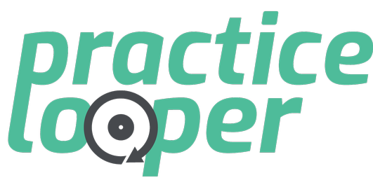

# Builds

|  OS          |     Version   |  Build Status |
|:-------------|:-------------|:--------------:|
| iOS | Lite |  |
| iOS |    Premium   |  |
| Android | Lite |  |
| Android | Premium |  |
